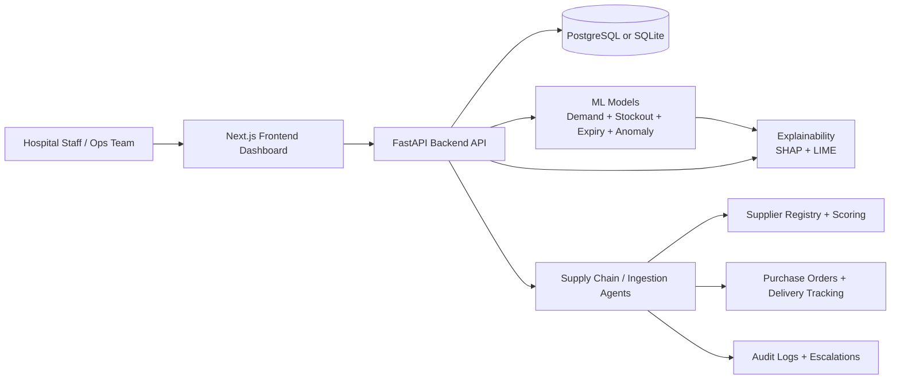

# AHIMP Project Guide

This document explains what this project is, why it exists, how it is built, and how to run and use it.
It is written for both technical and non-technical readers.

## 1) What This Project Does

AHIMP (Automated Hospital Inventory Management Platform) helps hospitals avoid medicine shortages, reduce expiry waste, and speed up procurement decisions.

It combines:
- A modern web dashboard for operations teams.
- A Python ML backend that predicts demand and risk.
- Agent workflows that support supplier search, ordering decisions, escalation, and audit trails.

In simple terms, the platform answers:
- Which items may run out soon?
- Which batches may expire soon?
- Which supplier is best for this medicine right now?
- Should we auto-order, request approval, or escalate to a human?

## 2) High-Level Architecture

## 3) Core Purpose by Module

### Frontend (Next.js)
- Shows KPIs, inventory status, alerts, trends, suppliers, orders, and AI insights.
- Calls backend APIs using typed client functions.
- Works even if some backend endpoints are unavailable by handling null/empty responses gracefully.

Main frontend areas:
- `app/`: route-based pages (dashboard, inventory, suppliers, orders, reports, AI predictions).
- `components/`: reusable UI blocks and layout.
- `lib/ml-api.ts`: typed API client for backend communication.
- `lib/inventory-context.tsx`: app state and inventory helpers.

### Backend (FastAPI)
- Exposes prediction, risk, explainability, supplier, supply-chain, order, approval, delivery, and audit endpoints.
- Initializes database and models at startup.
- Uses saved model artifacts to skip expensive retraining when possible.

Main backend areas:
- `backend/main.py`: app startup + router registration.
- `backend/api/`: API route modules.
- `backend/database/`: ORM models, schema, DB session, seed logic.
- `backend/models/`: ML models and explainability.
- `backend/agents/`: agent workflows/tools.

## 4) Tech Stack

### Frontend stack
- Next.js 16 (App Router)
- React 19 + TypeScript
- Tailwind CSS 4
- Radix UI components
- Recharts (charts/visualizations)

### Backend/API stack
- FastAPI + Uvicorn
- SQLAlchemy ORM
- PostgreSQL (recommended) or SQLite (dev)
- Pydantic schemas for request/response validation

### ML/AI stack
- LightGBM, CatBoost, XGBoost
- scikit-learn models (Random Forest, Logistic Regression, etc.)
- statsmodels (ARIMA)
- TensorFlow (LSTM support)
- SHAP + LIME explainability
- CrewAI + LangChain + Ollama integration for local LLM-based agent tasks

## 5) Data and Decision Flow

### A) Forecasting and risk flow
1. Consumption history is loaded from the database.
2. Feature engineering builds signals (rolling usage, seasonality, lag behavior, etc.).
3. Models generate:
   - demand forecasts,
   - stockout risk probabilities,
   - expiry risk probabilities,
   - anomaly flags.
4. Frontend displays these outputs in dashboard and AI pages.

### B) Supply-chain agent flow
1. At-risk items are identified.
2. Suppliers are searched and filtered by medicine match, reliability, and distance.
3. Quotes/recommendations are scored.
4. Decision engine routes each case to:
   - `AUTO_ORDER`,
   - `SUGGEST_HUMAN_APPROVAL`, or
   - `ESCALATE`.
5. Escalations and audit logs are stored for compliance.

### C) Compliance and traceability flow
- Every key agent action can be logged with session context.
- Audit endpoints support listing, explanation views, and summary reporting.
- Escalation workflows support open/resolved lifecycle.

## 6) API Surface (Practical Overview)

Common endpoint groups:
- Health: `/api/health`
- Predictions: demand, stockout, expiry, anomalies, model overview, explainability
- Agents: ingestion + supply-chain actions
- Supply chain ops: at-risk analysis, auto purchase, supplier search
- Governance: escalations, audit traces, audit summary
- Procurement ops: purchase orders, approvals, deliveries

Interactive docs:
- Backend Swagger UI: `http://localhost:9000/docs`

## 7) How to Run the Project

## Option 1: Full stack quick run (recommended for local dev)
From project root:
- Frontend: `pnpm dev`
- Backend: start FastAPI app from `backend/` with your Python env

If you use Docker-based PostgreSQL, run your compose stack first.

## Option 2: Backend only
From `backend/`:
1. Create virtual env and activate it.
2. Install dependencies from `requirements.txt`.
3. Run: `uvicorn main:app --reload --port 9000`

## Option 3: Frontend only
From root:
- `pnpm install`
- `pnpm dev`

Default URLs:
- Frontend: `http://localhost:3000`
- Backend: `http://localhost:9000`

## 8) Environment Variables You Should Know

Frontend:
- `NEXT_PUBLIC_API_BASE_URL` (example: `http://localhost:9000`)
- `NEXT_PUBLIC_AGENTS_API_KEY` (if backend agent routes are protected)

Backend (common examples):
- `DATABASE_URL`
- `AGENTS_API_KEY`
- `OLLAMA_BASE_URL`
- `OLLAMA_MODEL`
- `CREW_LLM_PROVIDER`

## 9) Why This Architecture Works

- Separation of concerns:
  - frontend for UX,
  - backend for APIs and orchestration,
  - ML modules for predictive intelligence,
  - agent modules for operational decision support.
- Explainability and auditability are first-class, which is essential for healthcare compliance.
- Model artifact caching/startup optimization reduces wait time during restarts.
- Typed API client in frontend reduces integration errors.

## 10) Typical Real-World Usage

### Inventory Manager
- Opens dashboard and sees low-stock/high-risk items.
- Reviews AI-driven recommendations.
- Confirms approvals or acts on escalations.

### Procurement Team
- Uses supplier recommendations and quote comparisons.
- Tracks order state from placement to delivery verification.
- Resolves escalations with notes.

### Admin/Compliance
- Reviews audit traces and summary reports.
- Validates why a specific decision was made.

## 11) Repository Map (Quick)

- `app/`: frontend routes
- `components/`: UI components
- `lib/`: client utilities and typed API layer
- `backend/api/`: FastAPI routes
- `backend/database/`: schema, models, DB access
- `backend/models/`: ML model training/inference/explainability
- `backend/agents/`: decision workflows and tool logic
- `backend/tests/`: backend test coverage

## 12) Current Strengths and Next Maturity Steps

Current strengths:
- End-to-end full-stack structure already in place.
- Rich API coverage for predictions and operations.
- Supply-chain audit and escalation support exists.

Recommended next steps:
- Add architecture decision records (ADRs) for major design choices.
- Add role-based access control if multiple hospital roles are expected.
- Add CI quality gates for lint, tests, and migration checks.
- Add production observability dashboards (latency, error rate, model drift).

---

If you are onboarding a new team member, start with:
1. This guide.
2. `backend/README.md` for backend command details.
3. `lib/ml-api.ts` to understand frontend-backend contracts.
4. `backend/main.py` to understand startup lifecycle.
